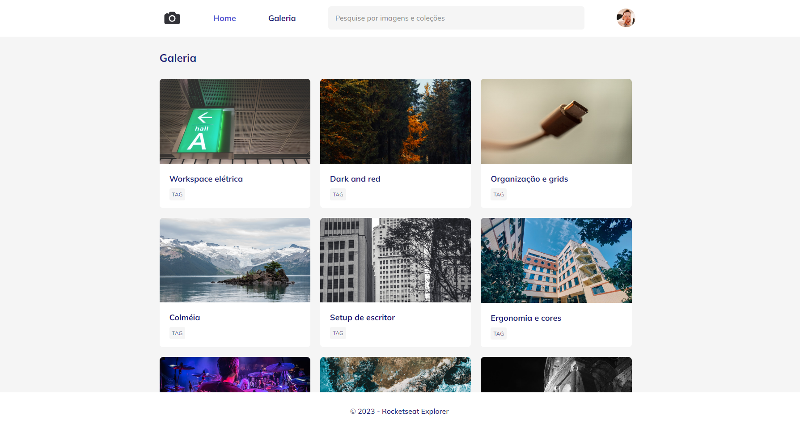

# FotoBlog

- Projeto - Nivel 03 - Avançando no css

Esse projeto de galeria de fotos é desenvolvido no nível 03 do Explorer, o programa completo da Rocketseat que te leva do zero até sua primeira vaga como dev.

> Nivel 03 - Reforçando a Responsividade e animações 

👉🏼[Link do projeto](https://fotoblog-stage-03.vercel.app/)

#  💻🔧 Tecnologias

- HTML
- CSS
- Git
- Git Hub

## Contato 💻

juniorjose1925@gmail.com

https://www.linkedin.com/in/jose-martinez-352032222/
